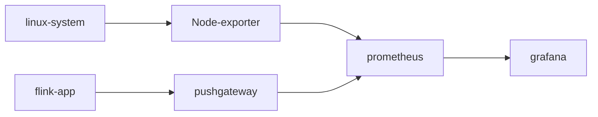
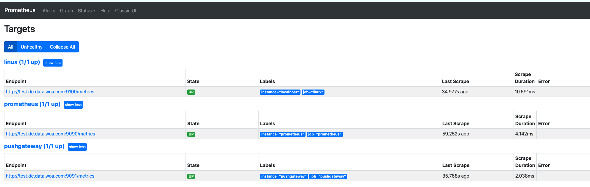

# flink metrics

## references

- [test-flink-prometheus-example](https://github.com/0x822a5b87/test-flink-prometheus-example)
- [基于grafana+prometheus构建Flink监控](https://www.cnblogs.com/Springmoon-venn/p/11445023.html)

## 项目架构



## 配置文件

### prometheus.yml

```yaml
global:
  scrape_interval:     60s
  evaluation_interval: 60s
 
scrape_configs:
  - job_name: prometheus
    static_configs:
      - targets: ['test.dc.data.woa.com:9090']
        labels:
          instance: prometheus
 
  - job_name: linux
    static_configs:
      - targets: ['test.dc.data.woa.com:9100']
        labels:
          instance: localhost
  - job_name: 'pushgateway'
    static_configs:
      - targets: ['test.dc.data.woa.com:9091']
        labels:
          instance: 'pushgateway'
```

### flink-conf.yaml

```yaml
################################################################################
jobmanager.rpc.address: jobmanager

# The RPC port where the JobManager is reachable.
jobmanager.rpc.port: 6123
# The total process memory size for the JobManager.
jobmanager.memory.process.size: 1600m
# The total process memory size for the TaskManager.
taskmanager.memory.process.size: 1728m
# The number of task slots that each TaskManager offers. Each slot runs one parallel pipeline.
taskmanager.numberOfTaskSlots: 10
# The parallelism used for programs that did not specify and other parallelism.
parallelism.default: 1


# The failover strategy, i.e., how the job computation recovers from task failures.
# Only restart tasks that may have been affected by the task failure, which typically includes
# downstream tasks and potentially upstream tasks if their produced data is no longer available for consumption.
jobmanager.execution.failover-strategy: region

# Interval in milliseconds for refreshing the monitored directories.
#historyserver.archive.fs.refresh-interval: 10000
blob.server.port: 6124
query.server.port: 6125


##metrics
metrics.reporter.promgateway.class: org.apache.flink.metrics.prometheus.PrometheusPushGatewayReporter
metrics.reporter.promgateway.host: test.dc.data.woa.com
metrics.reporter.promgateway.port: 9091
metrics.reporter.promgateway.jobName: flink-metrics
metrics.reporter.promgateway.randomJobNameSuffix: true
metrics.reporter.promgateway.deleteOnShutdown: false
```

## 部署基础组件

### 创建数据文件

```bash
docker volume create grafana-storage

docker volume create flink

docker volume create pushgateway
```

### 启动 containers

```bash
docker run -d -p 3000:3000 --name=grafana -v grafana-storage:/var/lib/grafana grafana/grafana

docker run -d -p 9100:9100 \
	-v "/proc:/host/proc:ro" \
	-v "/sys:/host/sys:ro" \
	-v "/:/rootfs:ro" \
	--net="host" \
	prom/node-exporter

docker run -d -p 9091:9091 prom/pushgateway

docker run -d -p 9090:9090 \
    -v prometheus:/etc/prometheus \
    -v "$(pwd)/prometheus.yaml:/etc/prometheus/prometheus.yml" \
    prom/prometheus
```

> 查看组件状态 `http://test.dc.data.woa.com:9090/targets`



### 启动 flink

```bash
FLINK_PROPERTIES="jobmanager.rpc.address: jobmanager"

docker network create flink-network

docker run -d --rm \
    --name=jobmanager \
    --network flink-network \
    --publish 8081:8081 \
    --env FLINK_PROPERTIES="${FLINK_PROPERTIES}" \
    -v "$(pwd)/flink-conf.yaml:/opt/flink/conf/flink-conf.yaml" \
    flink:1.14.2-scala_2.11 jobmanager
    
docker run -d --rm \
    -v "$(pwd)/flink-conf.yaml:/opt/flink/conf/flink-conf.yaml" \
    --name=taskmanager \
    --network flink-network \
    --env FLINK_PROPERTIES="${FLINK_PROPERTIES}" \
    flink:1.14.2-scala_2.11 taskmanager
```

### 配置 grafana

> 直接下载 [flink dashboard](https://grafana.com/grafana/dashboards/11049) 即可得到flink的基础配置信息。


